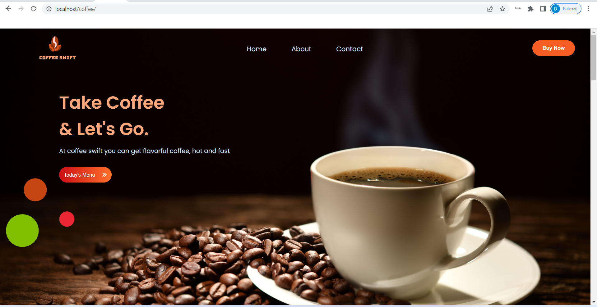

# coffee

Coffee Swift is an online web application that allows it users to order coffee of their choice online and it gets delivered to their desired addresses. The aim of this project,
is putting into consideration the hectic schedule that students and worker lead in most communities. 
We hope to bring the coffee order directly to you.

The SQL database of this project is connected using PHP on a local host server. The files are set up but to make it run the following steps are necessary. 

Install XAMP OR WAMP server.
locate the program files in your window directory; program/xamp/htdocs -- paste all the files in this repository in the directory except the db_coffee.sql file.
Start a server from the admin terminal.
Start the database from the admin terminal.
proceed to your browser and input localhost/phpmyadmin
Create a database
Import the database (the db_coffee file in this repository).
Proceed to your web browser and type in localhost/coffee to preview.
